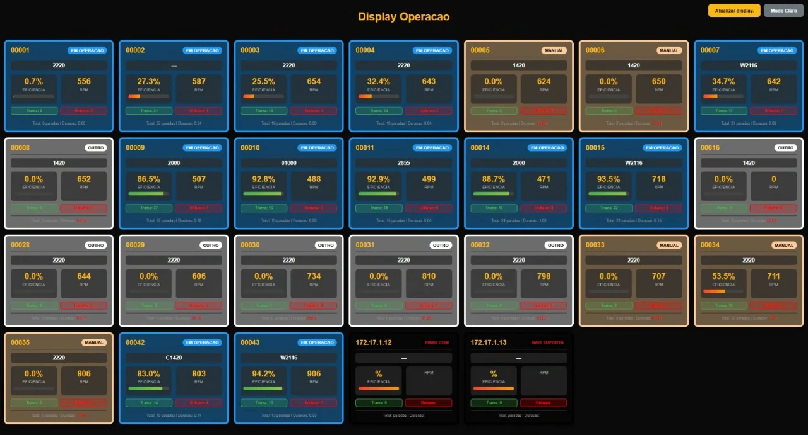

# 🏭 Toyota Loom Monitoring System (TMS) Modernization

*Visualização do monitoramento em tempo real nos teares Toyota.*

Este projeto consiste na modernização da interface de monitoramento em tempo real e na criação de uma pipeline de dados para teares industriais Toyota (Modelos JAT710 e similares). A solução substitui o layout legado do sistema TMS por um dashboard responsivo, performático e integrado a um ecossistema de Business Intelligence.

---

## 🚀 Diferenciais da Solução

* **Monitoramento em Tempo Real:** Interface web moderna com atualização automática (10s).
* **Alta Performance:** Coleta de dados via subprocessos paralelos (Pipes), evitando travamentos por latência de rede.
* **Design Responsivo:** Visualização otimizada para TVs industriais, tablets e smartphones.
* **Custo Zero de Hardware:** Reaproveitamento integral da infraestrutura legada.
* **BI Integrado:** ETL automático de arquivos TXT para banco de dados MariaDB com dashboards no Looker Studio.

## 🛠️ Tecnologias Utilizadas

* **Back-end:** Perl (CGI)
* **Front-end:** HTML5, CSS3 (Grid e Flexbox), JavaScript (Vanilla)
* **Banco de Dados:** MariaDB
* **Visualização de Dados:** Looker Studio
* **Infraestrutura:** Servidor TMS Toyota Original

## 📋 Funcionalidades

### 1. Dashboard de Chão de Fábrica
* **Cards Dinâmicos:** Cada tear é representado por um card que muda de cor conforme o status (ex: Azul para *Running*, Verde para *Weft Stop*, Vermelho para *Warp Stop*).
* **Métricas em Tempo Real:** Eficiência do turno, RPM atual e total de paradas.
* **Modo Escuro/Claro:** Alternância de tema para melhor visibilidade conforme a iluminação do ambiente.

### 2. Inteligência de Dados (ETL & BI)
* **Parsing de Dados:** Scripts processam os arquivos `.txt` brutos gerados pela Toyota.
* **Histórico de Produção:** Armazenamento centralizado para análise de tendências.
* **KPIs Monitorados:** * Eficiência por turno/dia.
    * MTTR (Tempo Médio de Atendimento).
    * Previsão de troca de rolo (*Doffing Forecast*).

## 📂 Estrutura de Arquivos Principais

* `getdata_modern.cgi`: Script principal que realiza a coleta paralela e renderiza o front-end.
* `common/`: Módulos de suporte Toyota (TMSstr, TMScommon, etc).
* `bin/httpc.exe`: Binário utilizado para as requisições HTTP paralelas aos teares.

## ⚙️ Configuração e Instalação

1. Clone este repositório dentro do diretório de scripts CGI do seu servidor TMS.
2. Certifique-se de que o Perl está instalado em `C:\Perl\bin\perl.exe`.
3. Configure a rotina de ETL para ler os arquivos na pasta `..\data\status\`.
4. Acesse via navegador: `http://[ip-do-servidor]/cgi-bin/getdata_modern.cgi`.

---
**Desenvolvido para otimização de processos têxteis.** 🧵